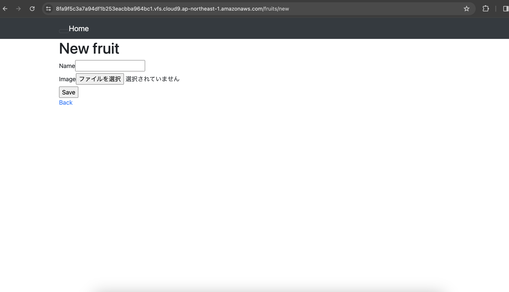
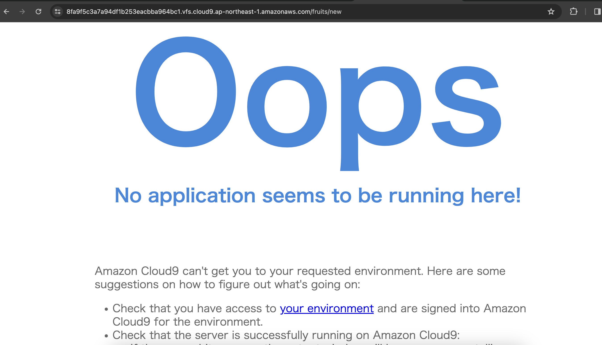
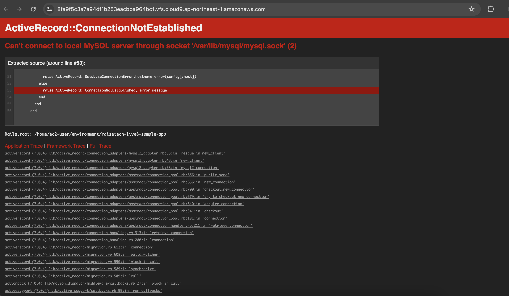

# 第三回課題
## 1.サンプルアプリケーションのデプロイ  

## 2.APサーバー
name:Puma version:5.6.5  
```bin/cloud9_dev```
APサーバーの終了

## 3.DBサーバー  
name:MySQL version:8.0.35  
```mysql -u root -p```  
停止  
```sudo service mysqld stop```  
再開  
```sudo service mysqld start```
  
## 4.Rails構成管理ツール
**bundler**  
bundlerとはgemのバージョンやgemの依存関係を管理するツール。あるgemを使うために別のあるgemを使う必要がるといった関係を依存関係という。bundlerは依存関係が解決されたgemを一括でインストールしてくれ、複数人（台）のPCで作業する際も同じバージョンのgemを一括でインストールすることができる。
## 5.感想
各コードの意味や、yarnなどの言葉の意味を調べながら進めたため約10日間という長時間かかってしまったが、ある程度の理解を持って進めることができた。しかし、正直なところ、全く同じサンプルアプリケーションを自分一人でデプロイできるかというと全くの自信はなく、場数を踏んで、コードや言葉、調べ方などの理解を深めて行く必要があると感じた。  
Markdown記法における画像の挿入や絶対パスと相対パス、Githubの画像挿入については最初全く分からず、ネットで調べ、皆さんの質問を参考にしながら、エラーも発生したが何とかできたことは少しの成長を感じられた。  
## 6.補足  
### MySQL
```mysql -u root -p```
 MySQLにrootユーザーでログイン  
```my cnf```
 MySQLで読み込まれる設定ファイル  
```which my cnf```
 設定ファイルの場所を表示
 Linuxの場合は/etc/my cnfにあることが多い  
### Ruby  
rvm:ruby version managerのことで、複数のRuby実行環境の管理を簡単にするスクリプトツール  
gem:ライブラリなどのパッケージ   
```rvm install "version"```
 rvmの指定したバージョンをインストール  
### yml  
ymlとは設定ファイルの形式に使われることが多い言語で、ソフトウェアやアプリケーションの設定情報を記述する際に使われる  
```cp config/database.yml.sample config/database.yml```
 Railsにおいて、データーベースとの接続におけるコード化したもの。各々がコピーしてコピー先を使用する。これはymlファイルにはパスワードを表記するため、セキュリティの観点から他者から覗かれないようにするため  
### catコマンド  
ファイルの中身を確認したいときに使用するLinuxコマンド  
### bin setup
Rails配下にあるbin/setupファイルの中身を実行するコマンド  
Bin/setupはRailsが用意している開発環境のセットアップようのスクリプトファイル  
### yarn
Javascriptをサーバーサイドで動かすための実行エンジンであるNode.js上で動作するパッケージマネージャー  
パッケージマネージャーとは、各ソフトウェアのインストールや更新などの操作、また他のソフトウェアとの依存関係を管理するためのツール  
```npm install --global yarn```
 yarnのインストール  
```yarn set version "version"```
 yarnのバージョン変更