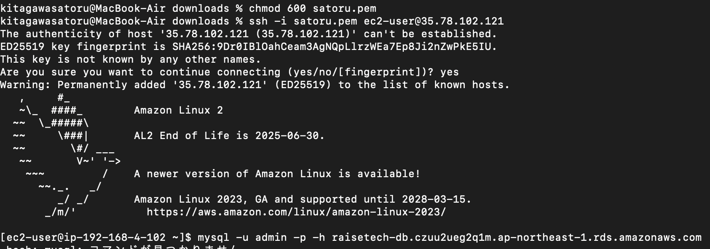

# 第4回講義課題  
## 1.VPC作成 
### 1-1.VPC   
  
  
### 1-2.サブネット  
  
  
  
  
## 2.EC2構築  
  
## 3.RDS構築  
  
    
## 4.セキュリティグループ  
### 4-1.EC2  
  
  
### 4-2.RDS  
  
  
## 5.SSHでローカルとEC2の接続  
```chmod 600 秘密鍵```  
```ssh -i 秘密鍵 ec2-user@パブリックIP```  
  
## 6.EC2とRDSの接続  
```mysql -u ユーザー名 -p -h エンドポイント```
  
## 7.所感  
最初は完成形のイメージを想像することができなかったため、ネットや他の方の質問を閲覧し、完成形をイメージできるようにしてから取り組んだことで、RDSへの接続までの簡単な流れは掴むことができた。しかし、各リソースの構築でエラーが勃発し、その解消するのに酷く時間がかかった。特にサブネットを作成する際のCIDRブロックが重複するとして設定できず、これはそもそもCIDRについて理解できていなかったことが原因であり、再度勉強し直してエラーを解消させた。また、EC2とRDSの接続について、RDSのセキュリティグループでEC2のセキュリティグループを指定していなかったため、接続できない状態であった。更にそれを解消するため、RDSのセキュリティグループを変更しようとしたところ、エラーで変更できず、結局原因はRDSとEC２のVPCがそれぞれ別の内容で設定していたためであり、これを解消するのに酷く時間を費やした。このように、各リソースを構築するのにエラーが多く発生し進まない状態が続いたものの、その解消の仕方やAWSに関する理解が進み、またエラーを解消できたときの喜びを感じることができ、学習に楽しさも感じた。  
RDSのセキュリティグループの設定内容について、インバウンドルールでEC2のセキュリティグループIDを設定することが正直現時点でもあまり理解できていないように感じる。調べていると、RDSとEC2を接続する上でEC2の鍵をRDSの鍵穴と一致させる必要があるという表現があり、これについては納得したものの、一致させるためにEC2のセキュリティグループIDを設定することがあまり腑に落ちないため、引き続きセキュリティグループについては深く学習する必要がある。