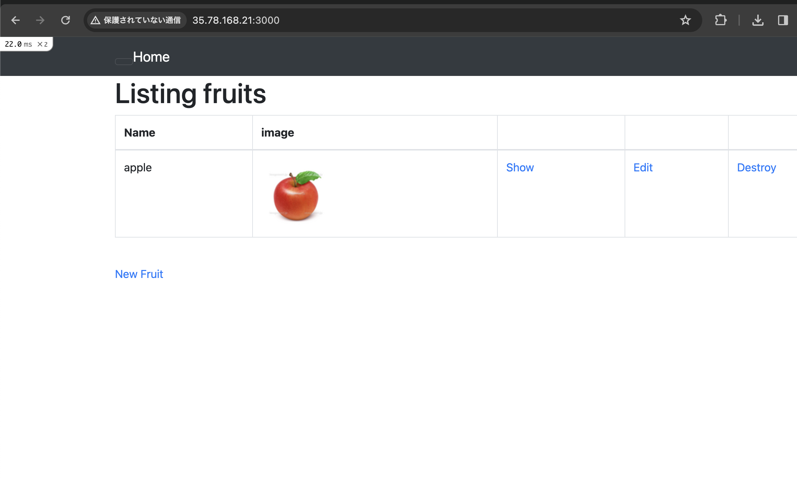
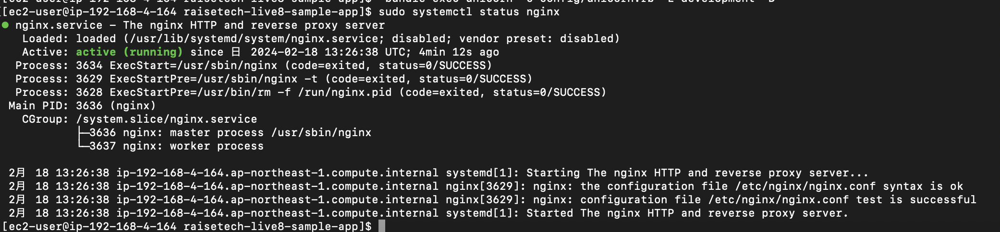
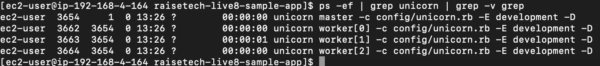
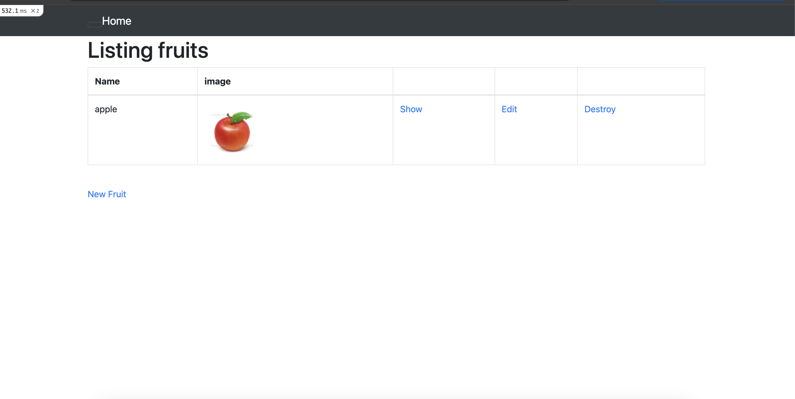
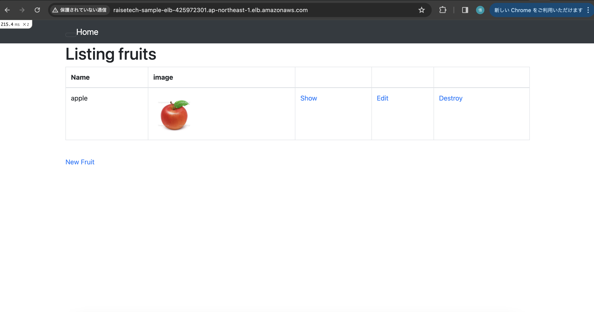
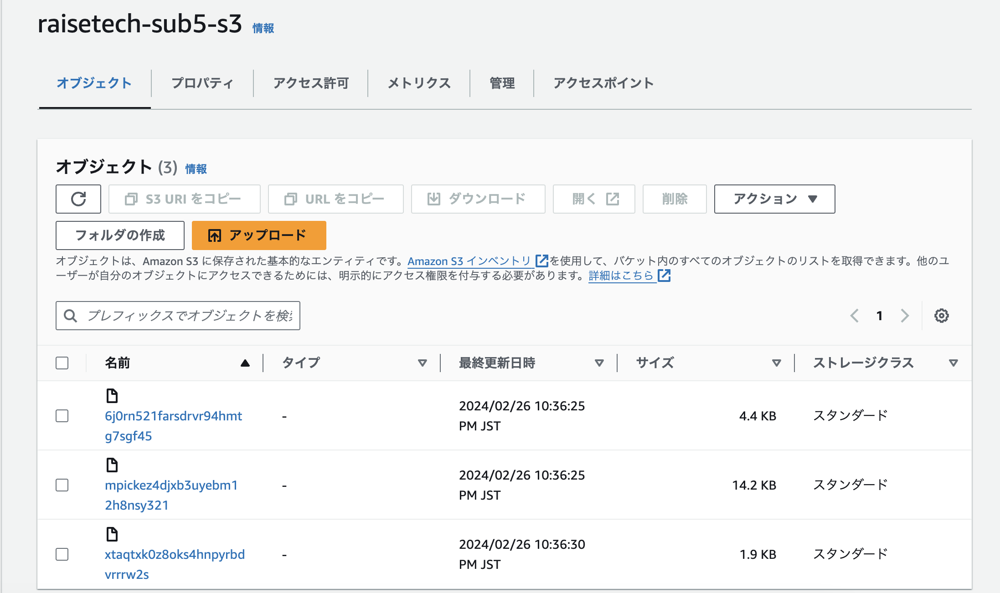
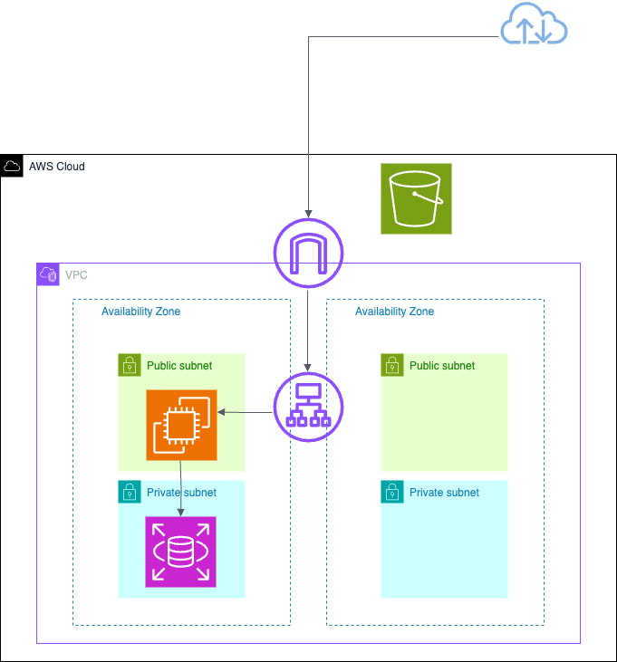

# 第５回課題講義  
## 組み込みサーバーでデプロイ
```
# パッケージのバージョンアップ
sudo yum update  

# railsのパッケージ  
sudo yum  -y install git make gcc-c++ patch libyaml-devel libffi-devel libicu-devel zlib-devel readline-devel libxml2-devel libxslt-devel ImageMagick ImageMagick-devel openssl-devel libcurl libcurl-devel curl  

# rbenvのインストール  
git clone https://github.com/sstephenson/rbenv.git ~/.rbenv  

# Ruby-buildのインストール  
git clone https://github.com/sstephenson/ruby-build.git ~/.rbenv/plugins/ruby-build  

# rbenvのコマンドハッシュ更新  
rbenv rehash  

# 指定したバージョンのRubyのインストール  
rbemv install -v 3.1.2  
rbenv global 3.1.2  
rbenv rehash  
ruby -v  

# Node.jsのインストール  
curl -o- https://raw.githubusercontent.com/nvm-sh/nvm/v0.38.0/install.sh | bash  
source ~/.bashrc  
nvm install v17.9.1  
node -v  

# yarnのインストール  
curl -sL https://dl.yarnpkg.com/rpm/yarn.repo | sudo tee /etc/yum.repos.d/yarn.repo  
sudo yum -y install yarn  
yarn -v  

# アプリケーションのクローン  
git clone コード  

# bundlerのインストール  
gem install bundler -v2.3.14  

# gemのインストール  
bundle install  

# yarnのインストール  
yarn install  

# railsのインストール  
gem install rails -v7.0.4  

# database.ymlの編集  
cp config/database.yml.sample config/database.yml  
default: &default  
username: ユーザー名  
password: RDSのパスワード  
host: RDSのエンドポイント  
yml記述のため記法に注意  

# 環境構築  
bin/setup  

# RDSの接続  
mysql -u ユーザー名 -p -h エンドポイント  
show databases;で接続確認  

# デプロイ  
rails s -b 0.0.0.0  

# ブラウザでアクセス  
EC2のパブリックID：3000
```  
 

## Nginx  
```  
# インストール  
sudo amazon-linux-extras install nginx1  

# 起動  
sudo systemctl start nginx  

# 停止  
sudo systemctl stop nginx  

# 再起動  
sudo systemctl restart nginx  

# 状態確認  
sudo systemctl status nginx  

# エラーログ  
sudo vi /var/log/nginx/error.log  
sudo tail /var/log/nginx/error.log  
```
→nginxの起動を確認：welcome to nginx!

## Unicorn  
```  
# Gemfileに追加  
vim Gemfile  
gem 'unicorn'を追加  

# 起動  
bundle exec unicorn_rails -c config/unicorn.rb -E development -D  

# 起動確認  
ps -ef | grep unicorn | grep -v grep  

# 停止  
kill -QUIT pid   
```  
# NginxとUnicornでデプロイ  
```  
# Nginxの設定ファイルを作成(rails.confという名称で作成)  
sudo vim /etc/nginx/conf.d/rails.conf  
 server unix:/home/ec2-user/raisetech-live8-sample-app/unicorn.sock  
 listen:80    
 server_name:ec2のパブリックIP  
 root:/home/ec2-user/raisetech-live8-sample-app/public  

# セキュリティグループ  
インバウンドルールでポート番号80を開放  

# ブラウザで確認  
EC2パブリックIP:80  

# 画像が表示されない場合  
sudo yum -y install ImageMagick
convert -version  
```  
Nginx起動確認  
   

Unicorn起動確認  
  

ブラウザで確認  
  

## ALBの追加  
1. ターゲットグループとセキュリティグループを作成  
1. ELB(ALB）を新規作成  
1. EC2のセキュリティグループにALBのセキュリティグループをポート80で開放 
1. config/environmets/development.rbに追加  
 `config.hosts << "ALBのDNS名"`  
***config/environments/development.rbについて***  
Railsアプリケーションを作成するとconfigディレクトリ直下にenvironmentディレクトリとその配下にdevelopment.rb、production.eb、test.rbフォルダが作成される  
 config: 設定ファイルを保存するディレクトリ  
 environments:環境毎の設定ファイルを保存するディレクトリ  
 development.rb:開発環境の設定ファイル  
5. NginxとUnicornを起動  
6. ALBのDNS名でブラウザを確認  
 

## S3の追加  
1. バケットを作成  
1. 作成したバケットにのみ権限付与するIAMポリシーを作成  
1. IAMユーザーの作成  
1. アクセスキーとシークレットアクセスキーを作成  
1. config/environments/development.rbの編集  
config.active_storage.service = :local  
→config.active_storage.service = amazon  
1. config/storage.ymlの編集  

IAMポリシー  
  
 
  

## 構成図  

  