# 課題６
## CloudTrail  
イベント名:StopInstances  
内容:  
* 誰が操作したか → Username  
* 何が影響を受けたか → AWS::EC2::Instance  
* 結果どうなったか → stopping  
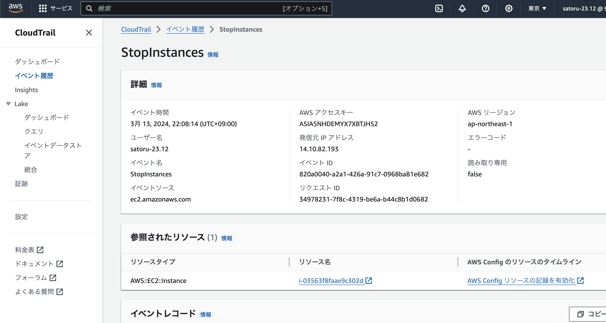   

## CloudWatchアラーム  
### パターン1:UnHealthyHostCountを対象  
#### 設定
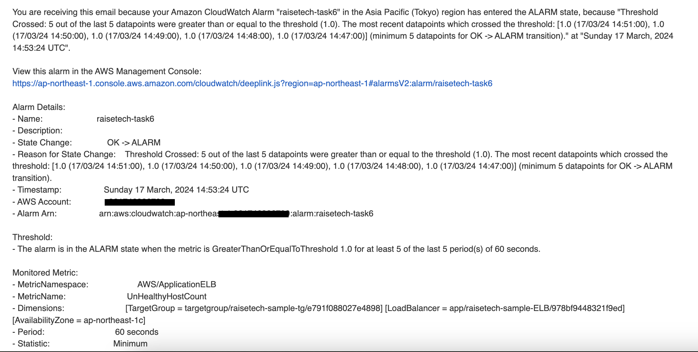  
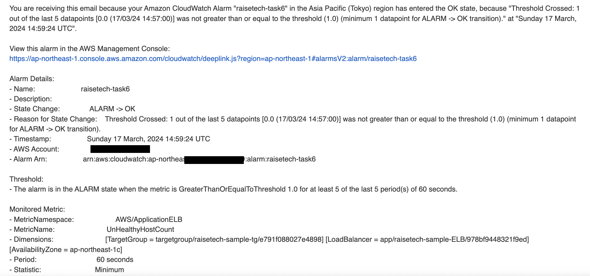  
* ステータスUnHealthy状態のターゲットグループの数を対象 
* 期間１分間で生成されるデータポイントが５回連続でしきい値（個数１以上）を超えるとアラーム通知  
* 欠落データポイントは「不良」とされ、しきい値超過として扱う＝breaching  
#### UnHealthy→Healty  
* UnicornとNginxを起動しアプリが正常稼働  
  
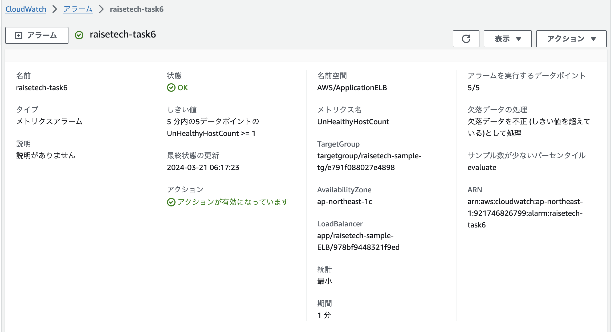  
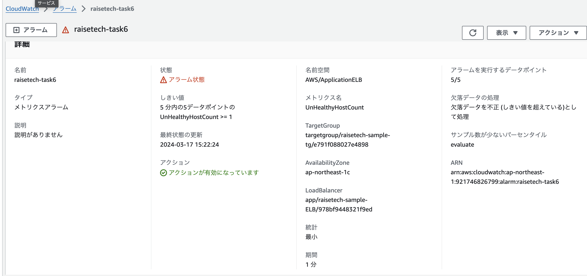  
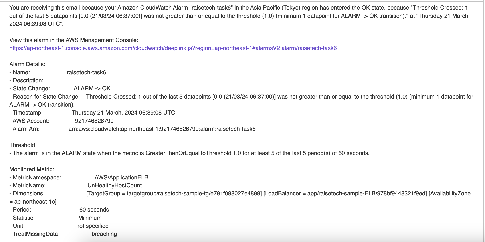  
#### Healthy→UnHealthy→Unused  
* Nginxを停止しアプリが異常稼働  
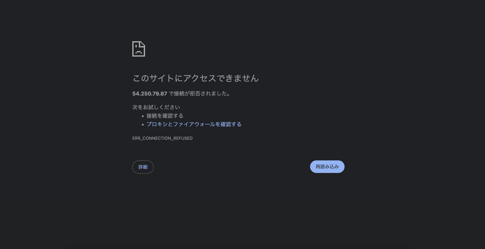  
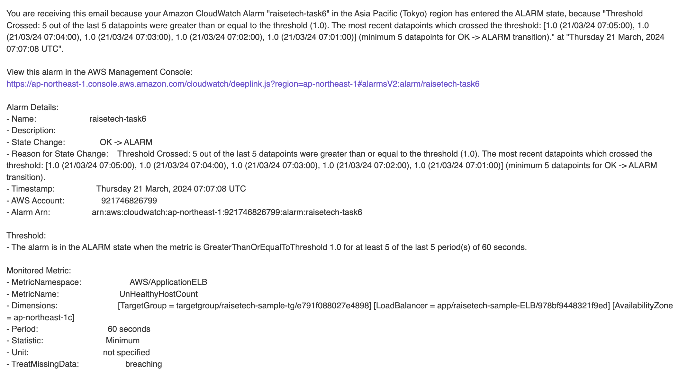  
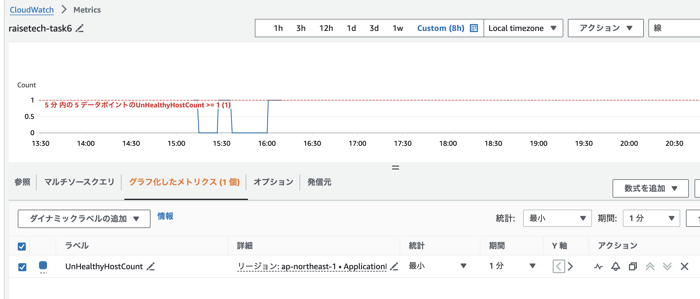  
* サーバーを停止  
	ヘルスステータスがUnusedとなる=欠落データポイントが発生  
	欠落データポイントをbreachingで設定しているためしきい値超過=UnHealthy時と同様  
### パターン2:HealthyHostCountを対象  
#### 設定  
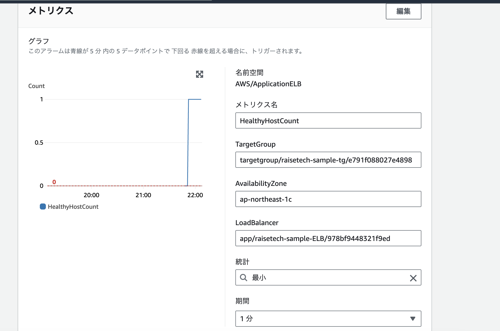   
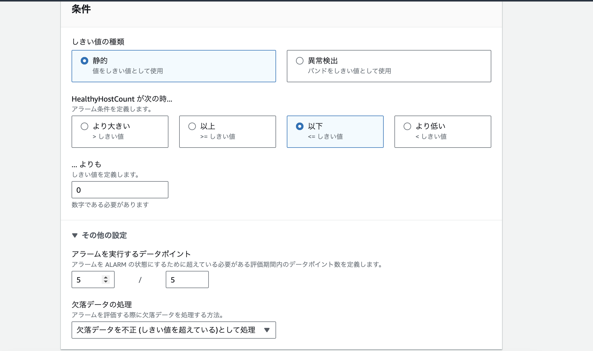  
* ステータスHealthy状態のターゲットグループの数を対象 
* 期間１分間で生成されるデータポイントが５回連続でしきい値（個数0以下）を超えるとアラーム通知  
* 欠落データポイントは「不良」とされ、しきい値超過として扱う＝breaching  
#### UnHealthy→Healty  
* UnicornとNginxを起動しアプリが正常稼働  
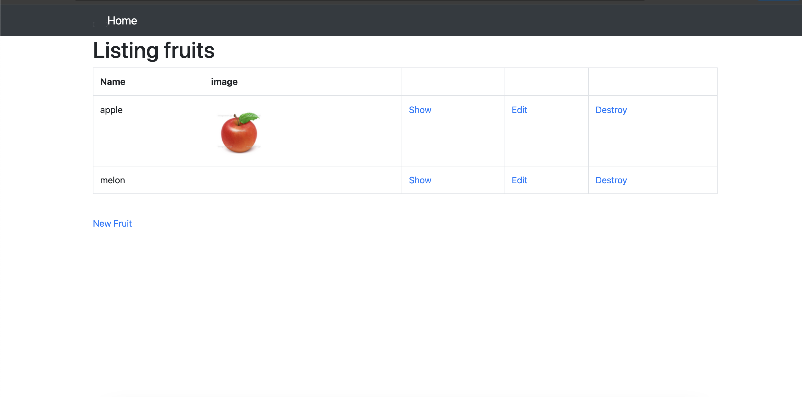  
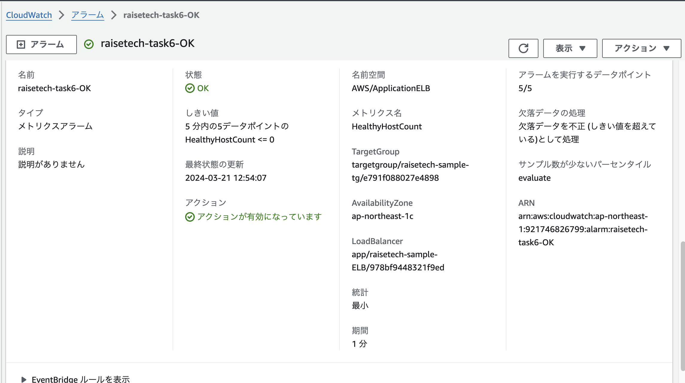  
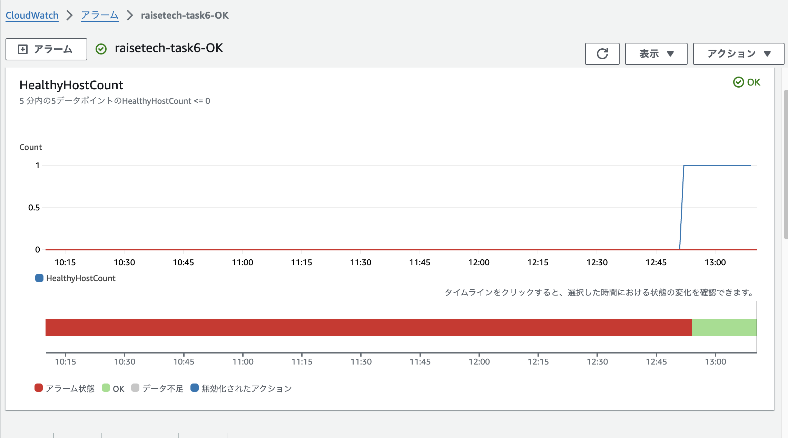  
  
#### Healthy→UnHealthy→Unused  
* Nginxを停止しアプリが異常稼働  
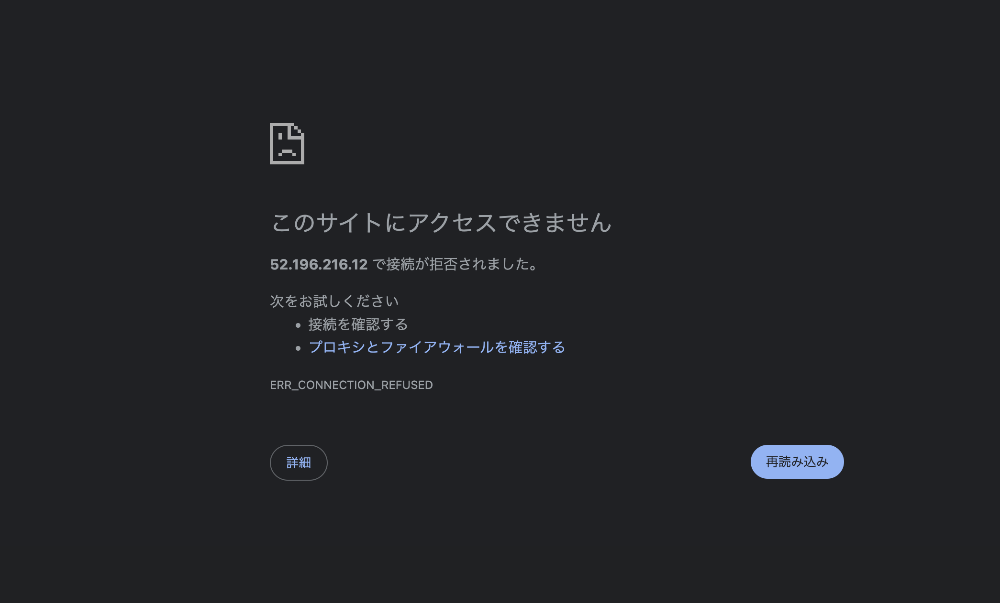  
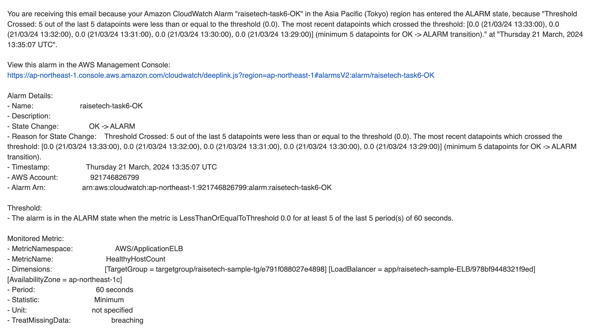  
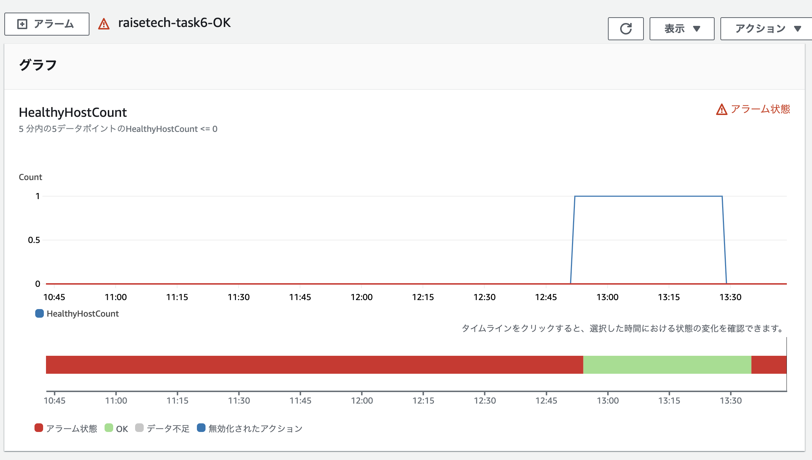  
* サーバーを停止  
	ヘルスステータスがUnusedとなる=欠落データポイントが発生  
	欠落データポイントをbreachingで設定しているためしきい値超過=UnHealthy時と同様  

## AWS利用料の見積  
[AWS利用料見積](https://calculator.aws/#/estimate?id=1f18ff6208ca500eb8e9fe9813da1649942aef08)  

## 現在の利用料  
* 3月の利用料  
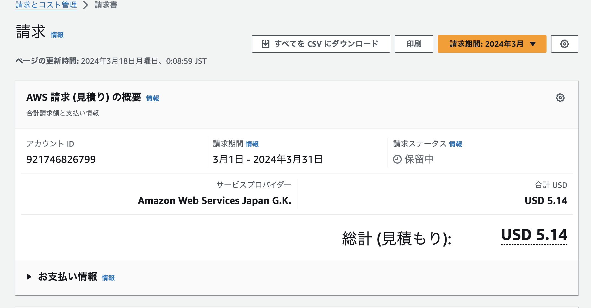  
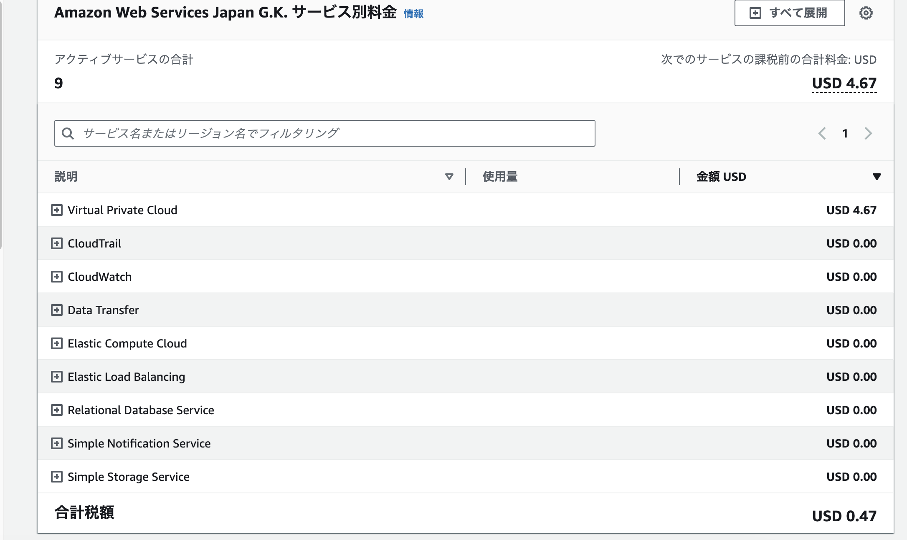  
### 考察  
3月の利用料の内訳によると、VPCで料金が発生している。そこで、Cost Explorerで粒度を日別の条件で確認したところ、２月１日から毎日VPCで$0.12、2月19日から毎日$0.24が発生してることを把握した。そこで、調べたところ、2月1日からパブリックIPv4アドレスに対し時間あたりの費用が発生するよう仕様が変更されているようである。そのため、2月1日から料金が発生（この時はパブリックIPv4アドレスを付けたEC2インスタンスが1つ）しており、2月19日からはパブリックIPv4アドレスを付けたEC2インスタンスを2つにしたことで料金が増加したものと考えられる。