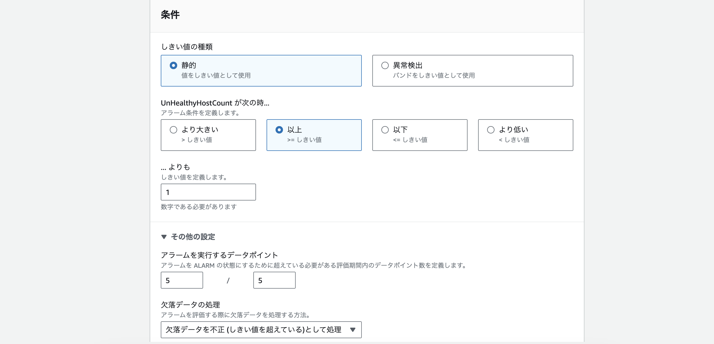

# 課題６
## CloudTrail  
イベント名:StopInstances  
内容:  
* 誰が操作したか → Username  
* 何が影響を受けたか → AWS::EC2::Instance  
* 結果どうなったか → stopping  
   

## CloudWatchアラーム  
* ALARM設定
  
* UnHealthy ↔ Healthy
  
  
  
  

## AWS利用料の見積  
[AWS利用料見積](https://calculator.aws/#/estimate?id=3558208f49010e50effdba2c80d6b9f62b27e0ce)  

## 現在の利用料  
* 3月の利用料  
  
