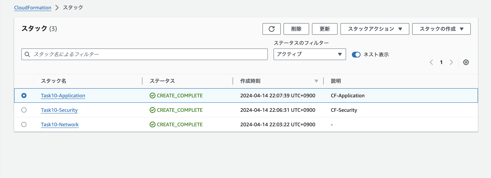
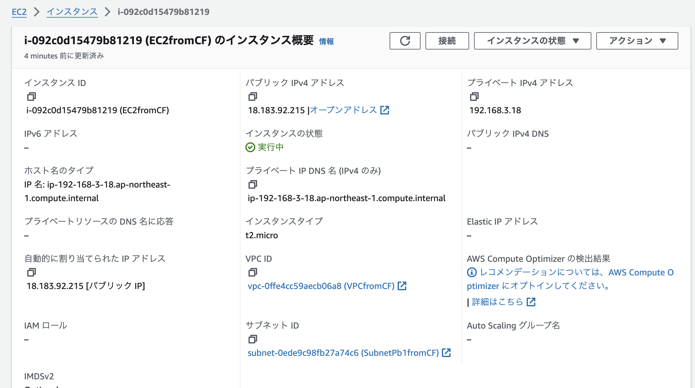
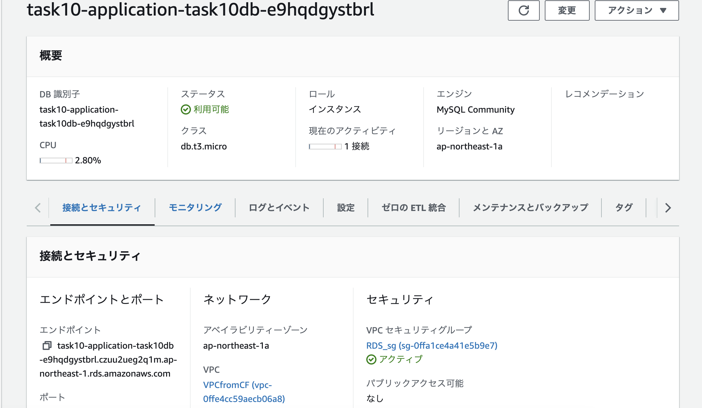
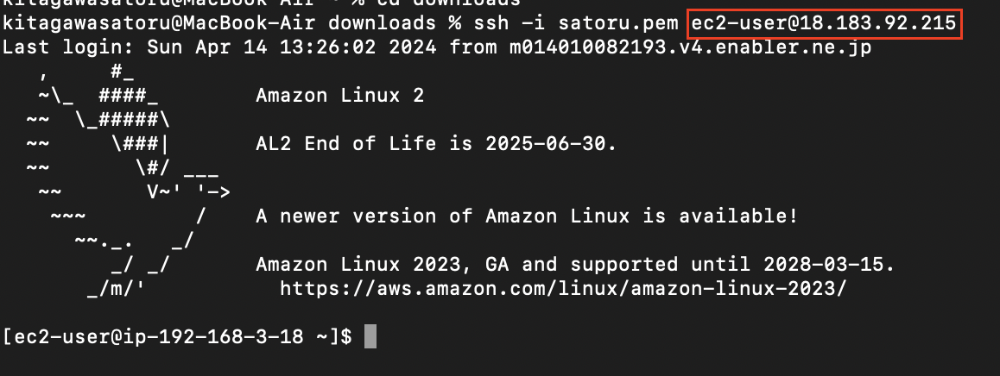
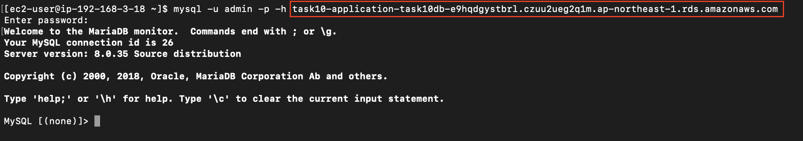

# 課題10  
## 課題内容  
CloudFormationを利用して、現在までに作った環境をコード化  
コード化ができたら実行し、環境が自動で作られることを確認  

## 構造  
Network: VPC サブネット インターネットゲートウェイ  
Application: EC2 RDS ELB S3   
Security: セキュリティグループ  

## テンプレート  
[Network](Task10-CF/Task10-Network.yml)  
[Application](Task10-CF/Task10-Application.yml)  
[Security](Task10-CF/Task10-Security.yml)  

## スタック  
  

## EC2とRDSの接続確認  
  
  
  
  

## 所感  
CloudFormationを使うにあたって、そもそも各リソースの具体的な設定内容を細かく把握していなかったため、AWSコンソールからGUIで各リソースを再度作成した。このことから、自分の知識が各リソースを大雑把にしか理解できておらず、一つ一つ深い設定内容を理解すべきと感じ、自身の不足している知識が露見した。
今後は今回の課題で作成したリソースをスムーズに作成することや、他リソースの作成をするなどして、CloudFormationへの理解を深めたい。