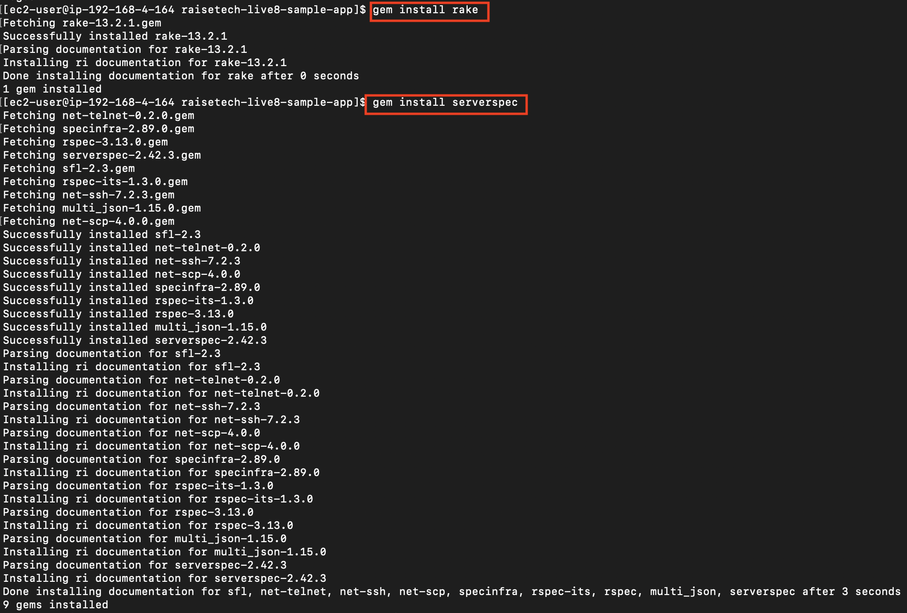
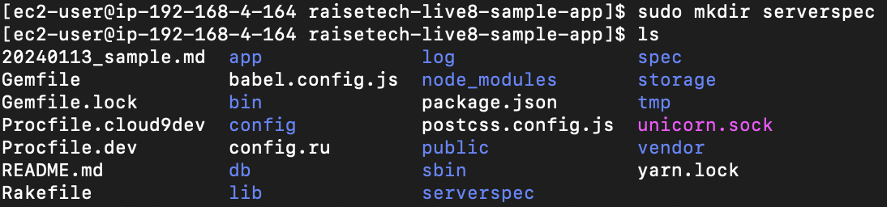
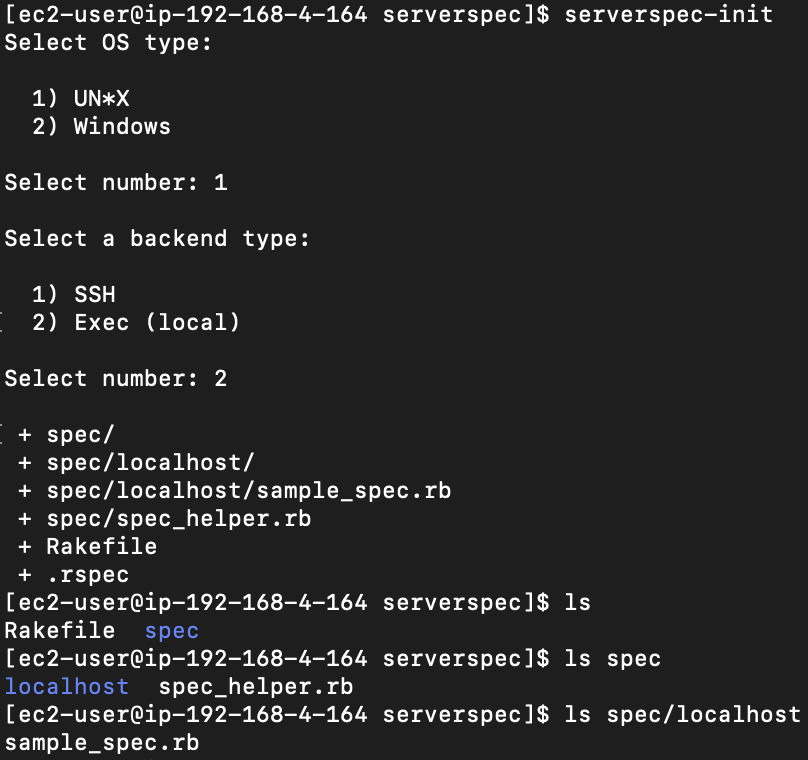
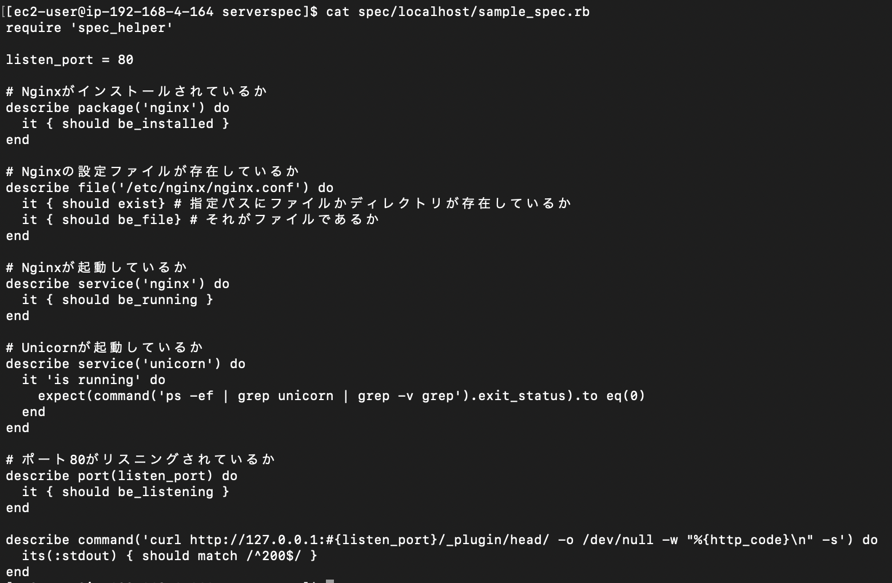
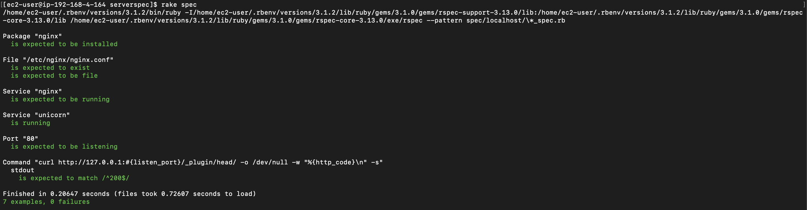

# 第１１回課題  

## 内容  
第５回課題のアプリケーションを基にServerspecのテストが成功すること  

## Serverspecとは  
Rspecでサーバーの構成に問題がないかを自動でテストするフレームワーク  

## 手順  
### インストール  
```
gem install rake  
gem install serverspec  
```  

### 作業用ディレクトリの作成  
1. serverspecというディレクトリを作業用に作成  
2. 作業用ディレクトリに移動  

### テスト実行用のファイルを作成  
1. `serverspec-init`  
2. serverspec/spec/localhost/sample_spec.rbが作成される

```
serverspec-init  
  
# 以下対話的な入力  
Select OS type:  
  
 1) UN*X  
 2) Windows  
 # 1を選択  
Select number: 1  

Select a backend type:  
  
 1) SSH  
 2) Exec(local)  
 # 2を選択  
Select number: 2  
```  

### テスト内容の記載  
Sample_spec.rbへテストする内容を記載する  
今回は以下のように記述  
```
require 'spec_helper'  
  
listen_port = 80  
  
# Nginxがインストールされているか  
describe package('nginx') do  
  it { should be_installed }  
end  
  
# Nginxの設定ファイルが存在しているか  
describe file('/etc/nginx/nginx.conf') do  
  it { should exist} # 指定パスにファイルかディレクトリが存在しているか  
  it { should be_file} # それがファイルであるか  
end  
  
# Nginxが起動しているか  
describe service('nginx') do  
  it { should be_running }  
end  
  
# Unicornが起動しているか  
describe service('unicorn') do  
  it 'is running' do  
    expect(command('ps -ef | grep unicorn | grep -v grep').exit_status).to eq(0)  
  end  
end  

# ポート80がリスニングされているか  
describe port(listen_port) do  
  it { should be_listening }  
end  
  
describe command('curl http://127.0.0.1:#{listen_port}/_plugin/head/ -o /dev/null -w "%  {http_code}\n" -s') do  
  its(:stdout) { should match /^200$/ }  
end  
```  
### テストを実行  
```
# テストを実行  
rake spec  

# 結果  
Package "nginx"  
  is expected to be installed  
  
File "/etc/nginx/nginx.conf"  
  is expected to exist  
  is expected to be file  
  
Service "nginx"  
  is expected to be running  

Service "unicorn"  
  is running  
  
Port "80"  
  is expected to be listening  
  
Command "curl http://127.0.0.1:#{listen_port}/_plugin/head/ -o /dev/null -w "%{http_code}\n" -s"  
  stdout  
    is expected to match /^200$/  
  
Finished in 0.26948 seconds (files took 1.29 seconds to load)  
7 examples, 0 failures  
```  

## 証跡  
1.  インストール  
  
  
2. serverspecディレクトリの作成  
  
  
3. serverspec-initの実行  
  
  
4. テスト内容の記載  
  
  
5. テストの実行  
  