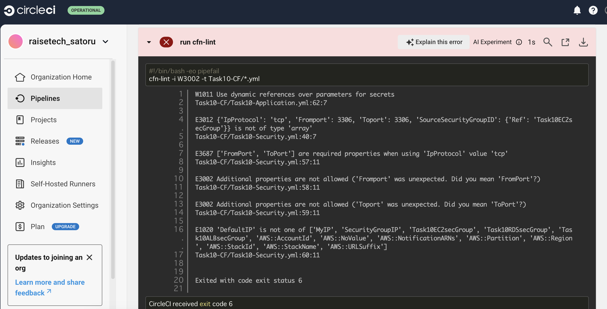

# 課題12  
## 内容  
CicleCiの[サンプルコンフィグ](sample-config.yml)を使用して、正しく動作するようにリポジトリに組み込む。  
:::note info  
インフォメーション  
cloudformation/*.ymlを自分のディレクトリ名に変更する  
cloudformation/*.yml→Task10-CF/*.yml  
:::  
## 処理結果  
### エラーの発生 
<dl> 
 <dt>エラー内容</dt>
 <dd>1.RDSのパスワードを動的参照にすること</dd>
 <dd>2.プロパティの誤り</dd>
</dl>  
<details><summary>参考画像</summary>
  
```rb

```
</details>  
