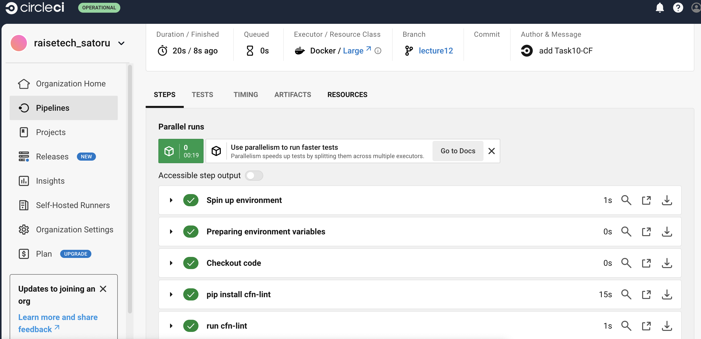

# 課題12  
## 内容  
CicleCIの[サンプルコンフィグ](sample-config.yml)を使用して、正しく動作するようにリポジトリに組み込む。  
>[!NOTE]  
>cloudformation/*.ymlを自分のディレクトリ名に変更する  
>cloudformation/*.yml→Task10-CF/*.yml  
## 処理結果  
### エラーの発生  
* ハードコーティング（画像なし）  
* RDSのパスワードを動的参照にすること  
* プロパティの誤り(大文字・小文字の表記誤り)  
  
### エラーの解消  
エラー内容を解消後、再度CircleCIを実行  
  
## 所感  
当初テストの自動化という意味が理解できなかったが、実際にCircleCIを実行することで非常に便利なツールであると驚かされた。また、それと同時に自らが作成したCloudFormationの記述コードの誤りが非常に多く発見されたことに少しショックであった。また、ハードコーティングやパスワードの動的参照も指摘されたことでセキュリティの観点からも非常に有用であると感じた。